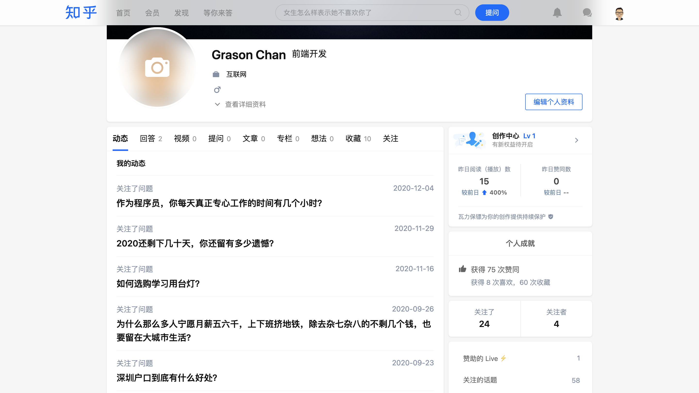

# simple-zhihu

## 使用

1. 安装 Stylish 相关的浏览器扩展
1. 打开 [Simple_Zhihu](https://userstyles.org/styles/142714/simple-zhihu) 页面，点击 `Customize Settings` 进行自定义设置，然后点击 `Install Style` 安装

## 说明

* **全局毛玻璃效果**：支持 `Safari`、`Chrome`、`Edge`、`Firefox`、`Opear` 等浏览器，请将浏览器升级到较新的版本
* **导航栏标题自动隐藏**：问题详情页中，导航栏的标题会自动隐藏，有助于隐私保护；鼠标悬停到指示箭头及其上方位置时，可暂时性重新显示标题

## 适配内容

* 导航栏标题自动隐藏
* 全局毛玻璃效果
* 新消息圆点标示
* 全局适配及广告去除

## 预览

### 导航栏标题自动隐藏（该动画做了放慢处理）

https://user-images.githubusercontent.com/19476925/122683987-6684a200-d235-11eb-9e7d-2bf809e95831.mov

### 全局毛玻璃效果

### 新消息圆点标示

### 页面

